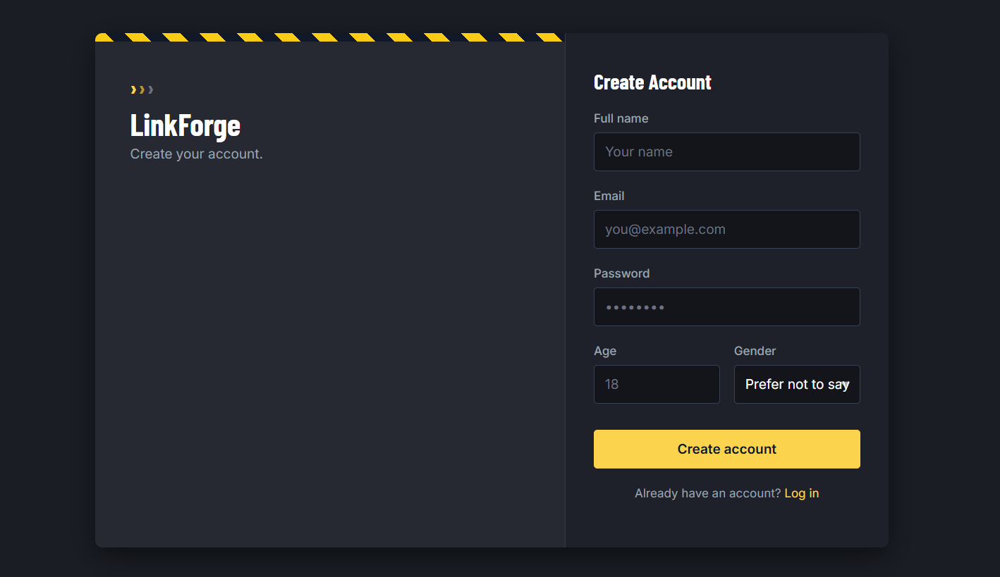
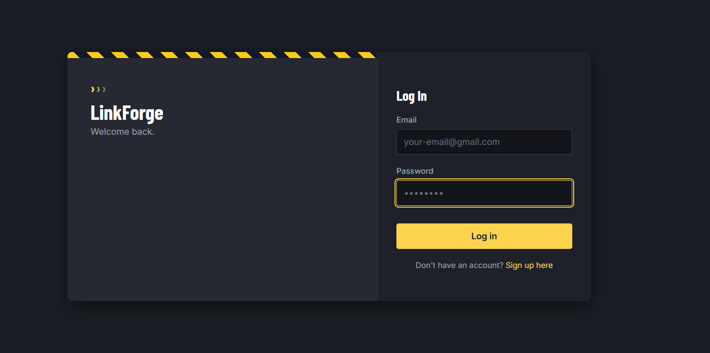
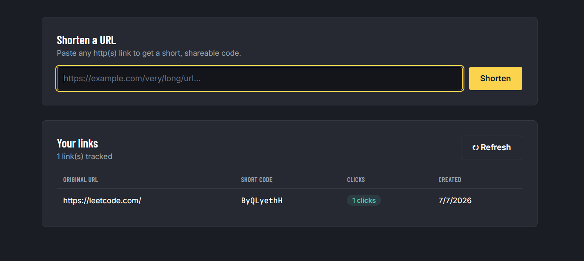

# 🔗 LinkForge

A full-stack URL shortener built with **Node.js**, **Express**, **MongoDB**, and **Redis** — register with email OTP verification, log in securely with JWT, paste a long URL and get a short, shareable link instantly, complete with QR code generation and a live per-user click-analytics dashboard.

[](https://linkforge-1rb1.onrender.com)

---

## ✨ Features

- 🔐 **Secure authentication** — JWT-based sessions stored in HTTP cookies
- 📧 **Email OTP verification** — new accounts must verify a 6-digit OTP sent to their email before the account is created
- 🚫 **Token blacklisting** — logging out immediately invalidates the JWT via a Redis blocklist, rather than just deleting the cookie client-side
- 🛡️ **Rate limiting** — login, registration, and OTP verification are rate-limited per IP (via Redis) to slow down brute-force and spam attempts
- 🔗 Shorten any long URL instantly, scoped per logged-in user
- ♻️ **Duplicate detection** — re-shortening a URL you've already shortened returns your existing short link instead of creating a new one
- 📱 Auto-generated QR code for every shortened link
- 📊 Live analytics dashboard with per-link click tracking, scoped to your own account
- ✅ URL validation (HTTP/HTTPS only)
- 🔁 Fast redirects from short code to original destination with click-count tracking
- 💾 Persistent storage with MongoDB Atlas; Redis used for OTP staging, rate-limit counters, and blacklisted tokens

---

## 🛠️ Tech Stack

| Layer | Technology |
|---|---|
| Runtime | Node.js |
| Framework | Express.js |
| Database | MongoDB + Mongoose |
| Cache / Session store | Redis (OTP staging, rate limiting, token blacklist) |
| Authentication | JWT (`jsonwebtoken`) + HTTP cookies (`cookie-parser`) |
| Password hashing | bcrypt |
| Email delivery | Brevo API (HTTPS-based, avoids SMTP port issues on cloud hosts) |
| Short code generation | ShortID |
| QR code | qrcode |
| Environment config | dotenv |
| Frontend | HTML, CSS, vanilla JavaScript |

---

## 📁 Project Structure

```
LinkForge/
├── public/
│   ├── index.html                 # Landing page
│   ├── login.html                 # Login page
│   ├── register.html              # Registration + OTP verification page
│   ├── dashboard.html             # Authenticated dashboard (shorten + analytics)
│   ├── style.css                  # Styles
│   └── script.js                  # Frontend logic (auth flow, shortening, analytics)
├── src/
│   ├── config/
│   │   ├── database.js            # MongoDB connection
│   │   ├── redis.js               # Redis client + connection handling
│   │   └── emailSender.js         # Nodemailer/Gmail transporter
│   ├── controller/
│   │   ├── authController.js      # Register, OTP verification, login, logout
│   │   └── urlController.js       # Shorten, redirect, analytics
│   ├── middleware/
│   │   ├── userAuth.js            # JWT verification + Redis blocklist check
│   │   ├── rateLimiter.js         # Redis-backed rate limiting
│   │   ├── validateUrl.js         # URL validation
│   │   └── errorHandler.js        # Global error handler
│   ├── models/
│   │   ├── users.js               # Mongoose user schema
│   │   └── urlModel.js            # Mongoose URL schema
│   ├── routes/
│   │   ├── authRoutes.js          # /auth/* routes
│   │   └── urlRoutes.js           # /url/* routes
│   └── utils/
│       └── shortCodeGenerator.js  # Short code generator
├── .env.example                   # Environment variable template
├── .gitignore
├── package.json
└── server.js                      # Entry point
```

---

## 🔌 API Endpoints

### Auth

**Register (Step 1 — request OTP)**
```
POST /auth/register
```
```json
{
  "name": "Jane Doe",
  "emailId": "jane@example.com",
  "password": "yourpassword",
  "age": 25,
  "gender": "Female"
}
```
Stores a pending registration in Redis (hashed password + OTP, 5-minute expiry) and emails a 6-digit OTP. The user isn't created in MongoDB yet.

**Register (Step 2 — verify OTP)**
```
POST /auth/verify-register-otp
```
```json
{
  "emailId": "jane@example.com",
  "otp": "123456"
}
```
On success, creates the verified user in MongoDB and clears the pending Redis entry.

**Login**
```
POST /auth/login
```
```json
{
  "emailId": "jane@example.com",
  "password": "yourpassword"
}
```
Returns a JWT set as an HTTP cookie (`token`).

**Logout**
```
POST /auth/logout
```
Requires an authenticated session. Blacklists the current token in Redis until its natural expiry, then clears the cookie.

### URLs *(all require an authenticated session)*

**Shorten a URL**
```
POST /url/shorten
```
```json
{
  "originalUrl": "https://www.example.com/very/long/url"
}
```
```json
{
  "success": true,
  "shortenedUrl": "http://localhost:5000/abc123",
  "qrCode": "data:image/png;base64,..."
}
```

**Get your URLs (analytics)**
```
GET /url/analytics
```
```json
{
  "success": true,
  "totalUrls": 5,
  "data": [
    {
      "originalUrl": "https://www.example.com",
      "shortCode": "abc123",
      "clicks": 10,
      "createdAt": "2026-06-30T00:00:00.000Z"
    }
  ]
}
```

**Redirect to original URL**
```
GET /:shortCode
```
Redirects the browser to the original URL and increments the click counter.

---

## 📸 Screenshots

**Home**


**Sign up**


**Log in**


**Dashboard — shorten & track links**


---

## 🚀 Getting Started Locally

### Prerequisites
- [Node.js](https://nodejs.org/) v18 or higher
- A [MongoDB Atlas](https://www.mongodb.com/cloud/atlas) account (free tier works)
- A [Redis Cloud](https://redis.io/try-free/) instance (free tier works)
- A Gmail account with an [App Password](https://myaccount.google.com/apppasswords) generated (requires 2-Step Verification enabled)

### Installation

**1. Clone the repository**
```bash
git clone https://github.com/Sagartiwari1920/LinkForge.git
cd LinkForge
```

**2. Install dependencies**
```bash
npm install
```

**3. Set up environment variables**

Copy the example file:
```bash
cp .env.example .env
```

Then fill in your own values (see the table below for what each one does).

**4. Run the server**
```bash
npm start
```

**5. Open in your browser**
```
http://localhost:5000
```

---

## 🌍 Environment Variables

| Variable | Description | Example |
|---|---|---|
| `PORT` | Port the server runs on | `5000` |
| `MONGO_URI` | MongoDB connection string | `mongodb+srv://...` |
| `BASE_URL` | Base URL used to build short links | `http://localhost:5000` |
| `REDIS_USERNAME` | Redis username | `default` |
| `REDIS_PASSWORD` | Redis password | — |
| `REDIS_HOST` | Redis host | `your-instance.redis.io` |
| `REDIS_PORT` | Redis port | `13648` |
| `JWT_KEY` | Secret used to sign JWTs — use a long, random string in production | — |
| `GMAIL_USER` | Gmail address used to send OTP emails | `you@gmail.com` |
| `BREVO_API` | Api of email otp provider | string |

> ⚠️ Never commit your real `.env` file. `GMAIL_APP_PASSWORD` and `JWT_KEY` in particular should be treated as sensitive secrets — if any of them are ever exposed, rotate them immediately.

---

## 🔐 How Authentication & Security Work

- **Registration** is a two-step flow: submitting the form stages the account in Redis and emails an OTP; the account only lands in MongoDB after the OTP is verified within its 5-minute window.
- **Sessions** are JWTs signed with `JWT_KEY`, stored in an HTTP cookie, and verified on every protected request via the `userAuth` middleware.
- **Logout** doesn't just clear the cookie — it also blacklists the token in Redis until its original expiry, so a captured token can't be replayed after logout.
- **Rate limiting** is applied per-IP (via Redis) specifically on `/auth/register`, `/auth/verify-register-otp`, and `/auth/login` — the endpoints most exposed to abuse — without throttling normal page loads or the analytics dashboard.
- **Per-user data isolation** — shortened URLs and analytics are scoped to the logged-in user's ID; users only ever see their own links.

---

## ☁️ Deployment

This app can be deployed to any Node-friendly host (e.g. [Render](https://render.com/)) as a web service, connected to MongoDB Atlas and Redis Cloud, with all configuration supplied via environment variables — no hardcoded URLs or secrets in the codebase.

When deploying, remember to:
- Set all variables from the table above in your hosting provider's environment settings
- Update `BASE_URL` to your deployed domain so generated short links point to the right place
- Ensure your MongoDB Atlas and Redis Cloud instances allow connections from your host's IP range

---

## 🤝 Contributing

1. Fork the project
2. Create your feature branch (`git checkout -b feature/AmazingFeature`)
3. Commit your changes (`git commit -m 'Add some AmazingFeature'`)
4. Push to the branch (`git push origin feature/AmazingFeature`)
5. Open a Pull Request

---

## 👨‍💻 Author

**Sagar Tiwari**
GitHub: [@Sagartiwari1920](https://github.com/Sagartiwari1920)
